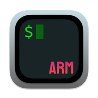

# darwin-arm64-node-env

基于 `Apple Silicon` 的 `macOS` (`darwin-arm64` ) 下 node 环境的搭建


- [1. 拷贝一个终端](#1-拷贝一个终端)
- [2. 安装 OhMyZsh](#2-安装-ohmyzsh)
- [3. 安装 homebrew](#3-安装-homebrew)
- [4. 安装 NVM](#4-安装-nvm)
- [5. 安装 Node.js](#5-安装-nodejs)
- [6. 附加的操作](#6-附加的操作)

## 1. 拷贝一个终端

> 选择一个常用的终端，如 [iTerm](https://iterm2.com/)

1. 首先, 前往 `/Applications` 将常用的终端拷贝一份，可以通过以下命令打开该目录：
    ```shell
    open /Applications
    ```
2. 选择一个终端，设置为以 `Rosetta` 启动
   - 右键应用图标，选择 `显示简介` （ 或选中图标使用快捷键 `⌘ + i` ）
   - 勾选通用下的 `使用 Rosetta 打开`
3. 重命名终端方便区分
  - 比如，两个终端分别为： `iTerm(arm)` | `iTerm(Rosetta)`

## 2. 安装 OhMyZsh

> 这一步不是必须的，但是方便后面配置环境变量
> 官网地址： [https://ohmyz.sh/#install](https://ohmyz.sh/#install)

通过以下两种方式可以直接安装（二选一）：

**Curl**

```shell
sh -c "$(curl -fsSL https://raw.github.com/ohmyzsh/ohmyzsh/master/tools/install.sh)"
```

**Wget**
```shell
sh -c "$(wget https://raw.github.com/ohmyzsh/ohmyzsh/master/tools/install.sh -O -)"
```


## 3. 安装 homebrew

**在上面新建的两个终端上分别安装 `homebrew` **， homebrew 在安装时，会自动判断当前终端的环境，所以在两个终端中分别执行安装命令，会安装不同的版本到不同的目录

> homebrew 官网： [https://brew.sh/](https://brew.sh/)

**在两个终端中分别执行安装命令**:

```shell
/bin/bash -c "$(curl -fsSL https://raw.githubusercontent.com/Homebrew/install/HEAD/install.sh)"
```

- `ARM` 版本的 `homebrew` 将被安装至 `/opt/homebrew/`
- `Rosetta` 版本的 `homebrew` 将被安装至 `/usr/local/homebrew`


**配置 brew**
打开终端的环境变量配置，如 `~/.zshrc`:

```shell
vim ~/.zshrc
```

添加以下配置：

```shell
if [ "$(sysctl -n sysctl.proc_translated)" = "1" ]; then
    local brew_path="/usr/local/homebrew/bin"
    local brew_opt_path="/usr/local/opt"
else
    local brew_path="/opt/homebrew/bin"
    local brew_opt_path="/opt/homebrew/opt"
fi
export PATH="${brew_path}:${PATH}"

```

更新后执行以下命令以生效

```shell
source ~/.zshrc
```

这样，就可以确保两个终端中运行的 `brew` 命令是对应的版本

## 4. 安装 NVM

首先， 准备 `nvm` 的安装目录, 打开**任意终端**执行：

```shell
mkdir ~/.nvm-x86 ~/.nvm
```

然后，在两个终端中分别使用 `homebrew` 安装 `nvm`:

```shell
brew install nvm
```

**配置 NVM**

打开 `.zshrc`, 更新上一步配置的 `homebrew`, 更新后为：

```shell
if [ "$(sysctl -n sysctl.proc_translated)" = "1" ]; then
    local brew_path="/usr/local/homebrew/bin"
    local brew_opt_path="/usr/local/opt"
    local nvm_path="$HOME/.nvm-x86"
else
    local brew_path="/opt/homebrew/bin"
    local brew_opt_path="/opt/homebrew/opt"
    local nvm_path="$HOME/.nvm"
fi

export PATH="${brew_path}:${PATH}"
export NVM_DIR="${nvm_path}"

[ -s "${brew_opt_path}/nvm/nvm.sh" ] && . "${brew_opt_path}/nvm/nvm.sh"  # This loads nvm
[ -s "${brew_opt_path}/nvm/etc/bash_completion.d/nvm" ] && . "${brew_opt_path}/nvm/etc/bash_completion.d/nvm"  # This loads nvm bash_completion
```

更新后执行以下命令以生效

```shell
source ~/.zshrc
```

## 5. 安装 Node.js

根据需要，在 `ARM` 和 `Rosetta` 的终端中使用 `nvm` 安装node，两边的 `node` 相互隔离

## 6. 附加的操作

可以将两个终端的图标替换，以便于区分，如：

**iTerm(arm)**:



**iTerm(x64)**:


> 如果需要这两个图标的 `icns` 文件，可在本项目的 `resources/` 下找到